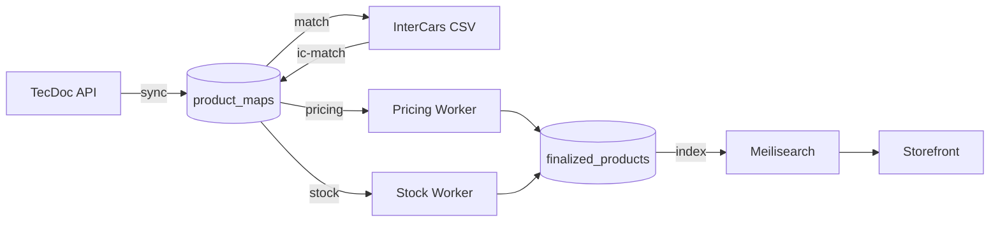

# Architecture

OEMline is a multi-supplier auto parts aggregation platform. It ingests product catalogs from external suppliers, matches them against a shared product map, resolves pricing and stock, and serves finalized products to the storefront.

## Stack

| Layer | Technology | Purpose |
|-------|-----------|---------|
| API server | Fastify | REST API for dashboard, storefront, and workers |
| ORM | Prisma | Schema management, migrations, typed queries |
| Database | PostgreSQL | Primary data store |
| Cache / Queues | Redis | API response caching, BullMQ job queue backend |
| Search | Meilisearch | Full-text product search for the storefront |
| Job processing | BullMQ | Background sync, matching, pricing, stock, indexing |
| Dashboard | Next.js | Admin UI for managing suppliers, products, jobs |
| Storefront | Next.js | Customer-facing product catalog and search |

## Services

The platform runs as separate services, each deployed as its own container:

| Service | Role |
|---------|------|
| **API** | Fastify server — handles all REST endpoints |
| **Worker: sync/match/index** | Runs sync, match, and index queues; owns the scheduler |
| **Worker: pricing/stock** | Dedicated pricing and stock queues (6x concurrency) |
| **Worker: ic-match** | InterCars CSV matching (isolated, concurrency=1) |
| **Dashboard** | Next.js admin panel |
| **Storefront** | Next.js customer site |
| **PostgreSQL** | Primary database |
| **Redis** | Cache + BullMQ backend |
| **Meilisearch** | Search engine |
| **MinIO** | Object storage (images, CSVs, FTP files) |

## Suppliers

| Supplier | Adapter type | Data provided |
|----------|-------------|---------------|
| **TecDoc** | `tecdoc` | Product catalog (articles, cross-references, images) |
| **InterCars** | `intercars` | Pricing and stock via OAuth2 API; SKU mapping via CSV |
| **Diederichs** | `diederichs` | Stock via DVSE SOAP API; pricing via FTP import |
| **Van Wezel** | `vanwezel` | Stock and pricing via REST API with JWT auth |
| **PartsPoint** | `partspoint` | Pricing and stock via API key |

Each supplier is configured in the database with encrypted credentials. Adapters are loaded dynamically from the `src/adapters/` registry at startup.

## Data Flow

**Step by step:**

1. **Sync** -- The TecDoc adapter fetches articles grouped by assembly group. Products land in `product_maps` with TecDoc metadata (article number, brand, EAN, OE numbers, images).
2. **IC Match** -- The ic-match worker maps TecDoc articles to InterCars SKUs using the CSV mapping table (565K rows). Matching runs in phases:
   - **Phase 0**: Direct override matches (manually set)
   - **Phase 1A**: Match by `tecdocId`
   - **Phase 1B**: Match by EAN
   - **Phase 1C**: Match by brand + article number
   - **Phase 1D**: Match by OE number
   - **Phase 2A-2C**: Fuzzy / secondary matching strategies
3. **Pricing** -- The pricing worker calls each supplier's `getPrice()` to fetch current prices.
4. **Stock** -- The stock worker calls each supplier's `getStock()` to fetch availability.
5. **Finalize** -- Resolved prices and stock are written to `finalized_products`.
6. **Index** -- The index worker pushes finalized products into Meilisearch for storefront search.

## Matching Engine

The matching engine resolves which supplier SKU corresponds to a given product map entry. It uses a 5-level priority system (highest wins):

| Priority | Strategy | Description |
|----------|----------|-------------|
| 1 | Override | Manually assigned SKU (admin dashboard) |
| 2 | TecDoc ID | Direct TecDoc article ID match |
| 3 | EAN | Barcode / EAN-13 match |
| 4 | Brand + Article | Brand name + article number combination |
| 5 | OEM | Original equipment manufacturer number |

## Workers

All workers use BullMQ with Redis as the backend. Concurrency is configurable per queue via environment variables.

**Queue groups and their worker assignments:**

| Queue | Worker service | Default concurrency | Schedule |
|-------|---------------|-------------------|----------|
| `sync` | sync/match/index | 1 | Every 4 hours |
| `match` | sync/match/index | 1 | Every 2 hours |
| `index` | sync/match/index | 1 | Every 6 hours |
| `pricing` | pricing/stock | 6 | On demand |
| `stock` | pricing/stock | 6 | On demand |
| `ic-match` | ic-match | 1 | Every 2 hours |

The scheduler runs only on the sync/match/index worker. It creates recurring jobs per active supplier.

Concurrency is controlled via:
- `WORKER_CONCURRENCY` -- global default for all queues
- `WORKER_CONCURRENCY_STOCK` -- per-queue override (also `_PRICING`, `_MATCH`, `_SYNC`, `_IC_MATCH`)

## Caching

- **Redis**: API response caching for supplier calls (stock, pricing) with TTL-based expiry.
- **Meilisearch**: Full-text search index rebuilt by the index worker. Supports faceted filtering by brand, category, and price range.
- **Adapter cache**: Loaded adapters are cached in memory and refreshed when the supplier record is updated in the database.
